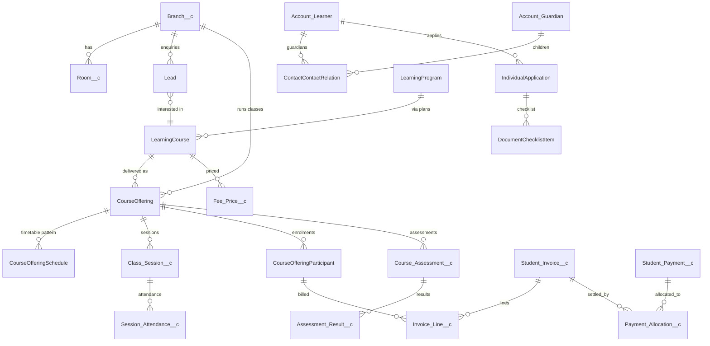

# 02 — Data Model

Generated metadata for custom objects comes from `scripts/tooling/specs.py` (run `python3 scripts/tooling/mdgen.py`). This document describes intent; the spec file is the source of truth for field lists.

## Entity relationship overview

## Phase 0 objects (deployed)

| Object                   | Sharing                                                     | Purpose                            | Key fields                                                                                                                                                                                                          |
| ------------------------ | ----------------------------------------------------------- | ---------------------------------- | ------------------------------------------------------------------------------------------------------------------------------------------------------------------------------------------------------------------- |
| `Branch__c`              | Public Read Only + Apex share to `Branch_Manager__c` (Edit) | Centre/campus and policy overrides | `Branch_Code__c` (unique, external ID), `Active__c`, `Branch_Manager__c`, `Invoice_Due_Days__c`, `Attendance_Threshold__c`, `Tax_Rate__c`, `Invoice_Prefix__c`, `Cancellation_Notice_Hours__c`, `Delivery_Modes__c` |
| `Room__c`                | Controlled by parent (Branch)                               | Bookable space                     | `Branch__c` (MD), `Capacity__c`, `Room_Type__c`, `Equipment__c`, `Meeting_Url__c`                                                                                                                                   |
| `Error_Log__c`           | Private (admins view all)                                   | Persistent application log         | `Severity__c`, `Source__c`, `Message__c`, `Stack_Trace__c`, `Record_Id__c`, `Transaction_Id__c`                                                                                                                     |
| `Log_Event__e`           | Platform event (publish immediately)                        | Transport for log entries          | mirrors `Error_Log__c`                                                                                                                                                                                              |
| `Education_Setting__mdt` | Custom metadata                                             | Organisation defaults              | `Value__c`, `Description__c`                                                                                                                                                                                        |
| `Status_Transition__mdt` | Custom metadata                                             | Allowed status transitions         | `Object_Name__c`, `Field_Name__c`, `From_Status__c`, `To_Status__c`, `Active__c`                                                                                                                                    |
| `Trigger_Control__mdt`   | Custom metadata                                             | Per-handler kill switch            | `Disabled__c` (DeveloperName = handler class)                                                                                                                                                                       |

## Phase 1 objects

Added feature by feature; see [PROGRESS.md](PROGRESS.md) for what is deployed. Each feature section below is completed when the feature is delivered.

### Design rules applied

1. Application status, enrolment status, payment status, and academic completion are separate fields on separate records.
2. The agreed price is copied to the enrolment and invoice line; later catalogue price changes never alter historical charges.
3. Invoice issuance, payment confirmation, and settlement/reconciliation are separate states.
4. Payment processing is idempotent on `Gateway_Transaction_Id__c` (unique external ID).
5. Published assessment results keep the grade that was calculated at publication time.
6. Every object that may be migrated has a unique `External_Id__c`.
