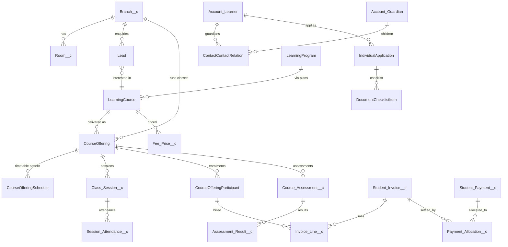

# 02 — Data Model

Generated metadata for custom objects comes from `scripts/tooling/specs.py` (run `python3 scripts/tooling/mdgen.py`). This document describes intent; the spec file is the source of truth for field lists.

## Entity relationship overview

## Phase 0 objects (deployed)

| Object                   | Sharing                                                     | Purpose                            | Key fields                                                                                                                                                                                                          |
| ------------------------ | ----------------------------------------------------------- | ---------------------------------- | ------------------------------------------------------------------------------------------------------------------------------------------------------------------------------------------------------------------- |
| `Branch__c`              | Public Read Only + Apex share to `Branch_Manager__c` (Edit) | Centre/campus and policy overrides | `Branch_Code__c` (unique, external ID), `Active__c`, `Branch_Manager__c`, `Invoice_Due_Days__c`, `Attendance_Threshold__c`, `Tax_Rate__c`, `Invoice_Prefix__c`, `Cancellation_Notice_Hours__c`, `Delivery_Modes__c` |
| `Room__c`                | Controlled by parent (Branch)                               | Bookable space                     | `Branch__c` (MD), `Capacity__c`, `Room_Type__c`, `Equipment__c`, `Meeting_Url__c`                                                                                                                                   |
| `Error_Log__c`           | Private (admins view all)                                   | Persistent application log         | `Severity__c`, `Source__c`, `Message__c`, `Stack_Trace__c`, `Record_Id__c`, `Transaction_Id__c`                                                                                                                     |
| `Log_Event__e`           | Platform event (publish immediately)                        | Transport for log entries          | mirrors `Error_Log__c`                                                                                                                                                                                              |
| `Education_Setting__mdt` | Custom metadata                                             | Organisation defaults              | `Value__c`, `Description__c`                                                                                                                                                                                        |
| `Status_Transition__mdt` | Custom metadata                                             | Allowed status transitions         | `Object_Name__c`, `Field_Name__c`, `From_Status__c`, `To_Status__c`, `Active__c`                                                                                                                                    |
| `Trigger_Control__mdt`   | Custom metadata                                             | Per-handler kill switch            | `Disabled__c` (DeveloperName = handler class)                                                                                                                                                                       |

| `Branch_Staff__c` | Controlled by parent (Branch) | User ↔ branch ↔ role | `Branch__c` (MD), `User__c`, `Role__c`, `Active__c`, `Unique_Key__c` (unique) |

## Phase 1 objects

Added feature by feature; see [PROGRESS.md](PROGRESS.md) for what is deployed.

### F1.1 Enquiries (deployed)

| Object                   | New fields                                                                                                                                                                                                                                                                                                                                                                                                                                                                                                                    |
| ------------------------ | ----------------------------------------------------------------------------------------------------------------------------------------------------------------------------------------------------------------------------------------------------------------------------------------------------------------------------------------------------------------------------------------------------------------------------------------------------------------------------------------------------------------------------- |
| `Lead`                   | `Branch__c`, `Interested_Course__c`, `Interested_Program__c`, `Enquiry_Channel__c`, `Preferred_Delivery_Mode__c`, `Learner_Birthdate__c`, `Guardian_First_Name__c`, `Guardian_Last_Name__c`, `Guardian_Email__c`, `Guardian_Phone__c`, `Guardian_Relationship__c`, `Next_Follow_Up__c`, `Last_Contacted__c`, `Trial_Session_Date__c`, `Lost_Reason__c`, `Possible_Duplicate__c`_, `Duplicate_Details__c`_, `Converted_Learner__c`_, `Converted_Application__c`_, `Submission_Id__c` (unique), `Follow_Up_Status__c` (formula) |
| `Account`                | `Branch__c` (home branch), `KEM_Role__c` (Learner / Guardian / Learner and Guardian)                                                                                                                                                                                                                                                                                                                                                                                                                                          |
| `IndividualApplication`  | `Branch__c`, `Learning_Course__c`, `Learning_Program__c`, `Source_Enquiry__c`*                                                                                                                                                                                                                                                                                                                                                                                                                                                |
| `ContactContactRelation` | `Is_Fee_Payer__c`, `Is_Emergency_Contact__c`, `Portal_Access__c`, `Guardian_Relationship__c`                                                                                                                                                                                                                                                                                                                                                                                                                                  |

\* system-managed (read-only to users, set by Apex).

### F1.2 Learners & guardians (deployed)

| Object                              | New fields                                                                                                          |
| ----------------------------------- | ------------------------------------------------------------------------------------------------------------------- |
| `Contact` (person accounts: `__pc`) | `Preferred_Channel__c`, `Preferred_Language__c`, `SMS_Opt_In__c`, `WhatsApp_Opt_In__c`, `Emergency_Instructions__c` |
| `LearnerProfile`                    | `Student_Number__c` (auto number `STU-{00000}`), `Branch__c`                                                        |

Guardian link convention: `ContactId` = guardian's person contact, `RelatedContactId` = learner's person contact, `PartyRoleRelation` = Guardian/Child.

### Design rules applied

1. Application status, enrolment status, payment status, and academic completion are separate fields on separate records.
2. The agreed price is copied to the enrolment and invoice line; later catalogue price changes never alter historical charges.
3. Invoice issuance, payment confirmation, and settlement/reconciliation are separate states.
4. Payment processing is idempotent on `Gateway_Transaction_Id__c` (unique external ID).
5. Published assessment results keep the grade that was calculated at publication time.
6. Every object that may be migrated has a unique `External_Id__c`.

### F1.4 Pricing (deployed)

| Object         | Sharing          | Key fields                                                                                                                                                                                                             |
| -------------- | ---------------- | ---------------------------------------------------------------------------------------------------------------------------------------------------------------------------------------------------------------------- |
| `Fee_Price__c` | Public Read Only | `Learning_Course__c`, `Branch__c` (blank = all), `Fee_Type__c`, `Delivery_Mode__c` (blank = all), `Billing_Frequency__c`, `Amount__c`, `Effective_From__c`, `Effective_To__c`, `Active__c`, `External_Id__c`           |
| `Discount__c`  | Public Read Only | `Code__c` (unique, upper case), `Discount_Type__c`, `Value__c`, `Fee_Type__c`, `Applies_To_Course__c`, `Applies_To_Branch__c`, `Valid_From__c`, `Valid_To__c`, `Max_Uses__c`, `Times_Used__c`*, `Requires_Approval__c` |

### F1.5 Enrolment (deployed)

| Object                                  | Fields                                                                                                                                                                                                               |
| --------------------------------------- | -------------------------------------------------------------------------------------------------------------------------------------------------------------------------------------------------------------------- |
| `CourseOffering` (class)                | `Branch__c`, `Room__c`, `Delivery_Mode__c`, `Class_Status__c`, `Seats_Taken__c`*, `Seats_Available__c` (formula), `Teacher_User__c`                                                                                  |
| `CourseOfferingParticipant` (enrolment) | `Application__c`_, `Branch__c`_, `Discount__c`_, `Discount_Approval_Status__c`_, `Agreed_Subtotal__c`_, `Agreed_Discount__c`_, `Agreed_Tax__c`_, `Agreed_Total__c`_, `Withdrawal_Reason__c`_, `Billing_Status__c`_   |
| `Enrolment_Fee_Line__c` (Private)       | `Enrolment__c`, `Fee_Price__c`, `Fee_Type__c`, `Billing_Frequency__c`, `Description__c`, `Unit_Amount__c`, `Discount_Amount__c`, `Tax_Rate__c`, `Tax_Amount__c`, `Line_Total__c`, `Invoiced__c` — all system-managed |

### F1.6 Scheduling (deployed)

| Object                            | Sharing          | Key fields                                                                                                                                                                                                                                                                                                                                                                      |
| --------------------------------- | ---------------- | ------------------------------------------------------------------------------------------------------------------------------------------------------------------------------------------------------------------------------------------------------------------------------------------------------------------------------------------------------------------------------- |
| `Class_Session__c`                | Public Read Only | `Course_Offering__c`, `Branch__c`, `Room__c`, `Teacher_User__c`, `Start__c`, `End__c`, `Status__c`, `Session_Type__c`, `Delivery_Mode__c`, `Schedule__c`, `Original_Start__c`_, `Rescheduled__c`_, `Cancellation_Reason__c`, `Meeting_Url__c`, `Attendance_Marked__c`_, `Teacher_Attendance__c`_, `Notes__c`, `Duration_Minutes__c` (formula), `External_Id__c` (class + start) |
| `Calendar_Closure__c`             | Public Read Only | `Branch__c` (blank = all), `Start_Date__c`, `End_Date__c`, `Closure_Type__c`                                                                                                                                                                                                                                                                                                    |
| `CourseOfferingSchedule` (native) | —                | weekly pattern: days, `StartTime`, `EndTime`, `StartDate`, `Type`                                                                                                                                                                                                                                                                                                               |

### F1.7 Attendance (deployed)

| Object                                          | Key fields                                                                                                                                                                                                   |
| ----------------------------------------------- | ------------------------------------------------------------------------------------------------------------------------------------------------------------------------------------------------------------ |
| `Session_Attendance__c` (controlled by session) | `Class_Session__c` (MD), `Learner__c`, `Enrolment__c`, `Status__c`, `Minutes_Late__c`, `Note__c`, `Marked_By__c`, `Marked_At__c`, `Corrected__c`, `Previous_Status__c`, `Unique_Key__c` — all system-managed |
| `CourseOfferingParticipant`                     | `Sessions_Attended__c`_, `Sessions_Missed__c`_, `Attendance_Rate__c`_, `Below_Attendance_Threshold__c`_                                                                                                      |

### F1.8 Assessments (deployed)

| Object                                        | Sharing   | Key fields                                                                                                                                                                                                                              |
| --------------------------------------------- | --------- | --------------------------------------------------------------------------------------------------------------------------------------------------------------------------------------------------------------------------------------- |
| `Course_Assessment__c`                        | Read Only | `Course_Offering__c`, `Assessment_Type__c` (Quiz, Test, Assignment, Exam, Project), `Max_Score__c`, `Weight__c`, `Assessment_Date__c`, `Grade_Scale__c`, `Status__c`_, `Published_On__c`_, `Published_By__c`_, `Average_Percentage__c`_ |
| `Assessment_Result__c` (controlled by parent) | —         | `Course_Assessment__c` (MD), `Learner__c`, `Enrolment__c`, `Score__c`, `Max_Score__c`, `Percentage__c` (formula), `Absent__c`, `Grade__c`, `Feedback__c`, `Status__c`, `Entered_By__c`, `Unique_Key__c` — all system-managed            |
| `Grade_Band__mdt`                             | —         | `Scale__c`, `Grade__c`, `Min_Percent__c` — Standard scale: A+ 90, A 80, B 70, C 60, D 50, F 0                                                                                                                                           |

### F1.9 Billing (deployed) — see ADR-002

| Object                                       | Sharing               | Key fields                                                                                                                                                                                                                                                                                                                                                      |
| -------------------------------------------- | --------------------- | --------------------------------------------------------------------------------------------------------------------------------------------------------------------------------------------------------------------------------------------------------------------------------------------------------------------------------------------------------------- |
| `Student_Invoice__c` (name = invoice number) | Private               | `Bill_To__c`, `Learner__c`, `Learner_Account__c`, `Enrolment__c`, `Branch__c`, `Sequence__c` (auto), `Status__c`, `Issue_Date__c`, `Due_Date__c`, roll-ups `Subtotal__c`, `Discount_Total__c`, `Tax_Total__c`, `Total__c`, `Amount_Paid__c`; formulas `Balance_Due__c`, `Overdue__c`; `Cancellation_Reason__c`                                                  |
| `Invoice_Line__c`                            | Controlled by parent  | `Student_Invoice__c` (MD), `Enrolment_Fee_Line__c`, `Fee_Type__c`, `Description__c`, `Unit_Amount__c`, `Discount_Amount__c`, `Tax_Amount__c`, `Line_Total__c`                                                                                                                                                                                                   |
| `Student_Payment__c` (`PAY-`)                | Private               | `Payer__c`, `Learner__c`, `Student_Invoice__c`, `Branch__c`, `Amount__c`, `Method__c`, `Status__c`, `Payment_Date__c`, `Reference__c`, `Gateway_Transaction_Id__c` (unique), roll-up `Allocated_Amount__c`, `Unallocated_Amount__c`, `Reconciliation_Status__c`, `Reconciliation_Note__c`, `Reconciled_On__c`, `Reconciled_By__c`, `Receipt_Number__c` (unique) |
| `Payment_Allocation__c` (junction)           | Controlled by parents | `Student_Invoice__c` (MD), `Student_Payment__c` (MD), `Amount__c`, `Allocated_On__c`                                                                                                                                                                                                                                                                            |
