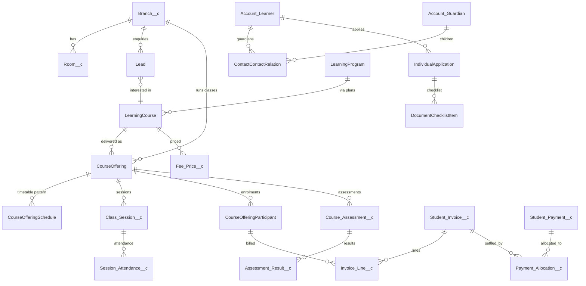

# 02 — Data Model

Generated metadata for custom objects comes from `scripts/tooling/specs.py` (run `python3 scripts/tooling/mdgen.py`). This document describes intent; the spec file is the source of truth for field lists.

## Entity relationship overview

## Phase 0 objects (deployed)

| Object                   | Sharing                                                     | Purpose                            | Key fields                                                                                                                                                                                                          |
| ------------------------ | ----------------------------------------------------------- | ---------------------------------- | ------------------------------------------------------------------------------------------------------------------------------------------------------------------------------------------------------------------- |
| `Branch__c`              | Public Read Only + Apex share to `Branch_Manager__c` (Edit) | Centre/campus and policy overrides | `Branch_Code__c` (unique, external ID), `Active__c`, `Branch_Manager__c`, `Invoice_Due_Days__c`, `Attendance_Threshold__c`, `Tax_Rate__c`, `Invoice_Prefix__c`, `Cancellation_Notice_Hours__c`, `Delivery_Modes__c` |
| `Room__c`                | Controlled by parent (Branch)                               | Bookable space                     | `Branch__c` (MD), `Capacity__c`, `Room_Type__c`, `Equipment__c`, `Meeting_Url__c`                                                                                                                                   |
| `Error_Log__c`           | Private (admins view all)                                   | Persistent application log         | `Severity__c`, `Source__c`, `Message__c`, `Stack_Trace__c`, `Record_Id__c`, `Transaction_Id__c`                                                                                                                     |
| `Log_Event__e`           | Platform event (publish immediately)                        | Transport for log entries          | mirrors `Error_Log__c`                                                                                                                                                                                              |
| `Education_Setting__mdt` | Custom metadata                                             | Organisation defaults              | `Value__c`, `Description__c`                                                                                                                                                                                        |
| `Status_Transition__mdt` | Custom metadata                                             | Allowed status transitions         | `Object_Name__c`, `Field_Name__c`, `From_Status__c`, `To_Status__c`, `Active__c`                                                                                                                                    |
| `Trigger_Control__mdt`   | Custom metadata                                             | Per-handler kill switch            | `Disabled__c` (DeveloperName = handler class)                                                                                                                                                                       |

| `Branch_Staff__c` | Controlled by parent (Branch) | User ↔ branch ↔ role | `Branch__c` (MD), `User__c`, `Role__c`, `Active__c`, `Unique_Key__c` (unique) |

## Phase 1 objects

Added feature by feature; see [PROGRESS.md](PROGRESS.md) for what is deployed.

### F1.1 Enquiries (deployed)

| Object                   | New fields                                                                                                                                                                                                                                                                                                                                                                                                                                                                                                                    |
| ------------------------ | ----------------------------------------------------------------------------------------------------------------------------------------------------------------------------------------------------------------------------------------------------------------------------------------------------------------------------------------------------------------------------------------------------------------------------------------------------------------------------------------------------------------------------- |
| `Lead`                   | `Branch__c`, `Interested_Course__c`, `Interested_Program__c`, `Enquiry_Channel__c`, `Preferred_Delivery_Mode__c`, `Learner_Birthdate__c`, `Guardian_First_Name__c`, `Guardian_Last_Name__c`, `Guardian_Email__c`, `Guardian_Phone__c`, `Guardian_Relationship__c`, `Next_Follow_Up__c`, `Last_Contacted__c`, `Trial_Session_Date__c`, `Lost_Reason__c`, `Possible_Duplicate__c`_, `Duplicate_Details__c`_, `Converted_Learner__c`_, `Converted_Application__c`_, `Submission_Id__c` (unique), `Follow_Up_Status__c` (formula) |
| `Account`                | `Branch__c` (home branch), `KEM_Role__c` (Learner / Guardian / Learner and Guardian)                                                                                                                                                                                                                                                                                                                                                                                                                                          |
| `IndividualApplication`  | `Branch__c`, `Learning_Course__c`, `Learning_Program__c`, `Source_Enquiry__c`*                                                                                                                                                                                                                                                                                                                                                                                                                                                |
| `ContactContactRelation` | `Is_Fee_Payer__c`, `Is_Emergency_Contact__c`, `Portal_Access__c`, `Guardian_Relationship__c`                                                                                                                                                                                                                                                                                                                                                                                                                                  |

\* system-managed (read-only to users, set by Apex).

### F1.2 Learners & guardians (deployed)

| Object                              | New fields                                                                                                          |
| ----------------------------------- | ------------------------------------------------------------------------------------------------------------------- |
| `Contact` (person accounts: `__pc`) | `Preferred_Channel__c`, `Preferred_Language__c`, `SMS_Opt_In__c`, `WhatsApp_Opt_In__c`, `Emergency_Instructions__c` |
| `LearnerProfile`                    | `Student_Number__c` (auto number `STU-{00000}`), `Branch__c`                                                        |

Guardian link convention: `ContactId` = guardian's person contact, `RelatedContactId` = learner's person contact, `PartyRoleRelation` = Guardian/Child.

### Design rules applied

1. Application status, enrolment status, payment status, and academic completion are separate fields on separate records.
2. The agreed price is copied to the enrolment and invoice line; later catalogue price changes never alter historical charges.
3. Invoice issuance, payment confirmation, and settlement/reconciliation are separate states.
4. Payment processing is idempotent on `Gateway_Transaction_Id__c` (unique external ID).
5. Published assessment results keep the grade that was calculated at publication time.
6. Every object that may be migrated has a unique `External_Id__c`.

### F1.4 Pricing (deployed)

| Object         | Sharing          | Key fields                                                                                                                                                                                                             |
| -------------- | ---------------- | ---------------------------------------------------------------------------------------------------------------------------------------------------------------------------------------------------------------------- |
| `Fee_Price__c` | Public Read Only | `Learning_Course__c`, `Branch__c` (blank = all), `Fee_Type__c`, `Delivery_Mode__c` (blank = all), `Billing_Frequency__c`, `Amount__c`, `Effective_From__c`, `Effective_To__c`, `Active__c`, `External_Id__c`           |
| `Discount__c`  | Public Read Only | `Code__c` (unique, upper case), `Discount_Type__c`, `Value__c`, `Fee_Type__c`, `Applies_To_Course__c`, `Applies_To_Branch__c`, `Valid_From__c`, `Valid_To__c`, `Max_Uses__c`, `Times_Used__c`*, `Requires_Approval__c` |

### F1.5 Enrolment (deployed)

| Object                                  | Fields                                                                                                                                                                                                               |
| --------------------------------------- | -------------------------------------------------------------------------------------------------------------------------------------------------------------------------------------------------------------------- |
| `CourseOffering` (class)                | `Branch__c`, `Room__c`, `Delivery_Mode__c`, `Class_Status__c`, `Seats_Taken__c`*, `Seats_Available__c` (formula), `Teacher_User__c`                                                                                  |
| `CourseOfferingParticipant` (enrolment) | `Application__c`_, `Branch__c`_, `Discount__c`_, `Discount_Approval_Status__c`_, `Agreed_Subtotal__c`_, `Agreed_Discount__c`_, `Agreed_Tax__c`_, `Agreed_Total__c`_, `Withdrawal_Reason__c`_, `Billing_Status__c`_   |
| `Enrolment_Fee_Line__c` (Private)       | `Enrolment__c`, `Fee_Price__c`, `Fee_Type__c`, `Billing_Frequency__c`, `Description__c`, `Unit_Amount__c`, `Discount_Amount__c`, `Tax_Rate__c`, `Tax_Amount__c`, `Line_Total__c`, `Invoiced__c` — all system-managed |

### F1.6 Scheduling (deployed)

| Object                            | Sharing          | Key fields                                                                                                                                                                                                                                                                                                                                                                      |
| --------------------------------- | ---------------- | ------------------------------------------------------------------------------------------------------------------------------------------------------------------------------------------------------------------------------------------------------------------------------------------------------------------------------------------------------------------------------- |
| `Class_Session__c`                | Public Read Only | `Course_Offering__c`, `Branch__c`, `Room__c`, `Teacher_User__c`, `Start__c`, `End__c`, `Status__c`, `Session_Type__c`, `Delivery_Mode__c`, `Schedule__c`, `Original_Start__c`_, `Rescheduled__c`_, `Cancellation_Reason__c`, `Meeting_Url__c`, `Attendance_Marked__c`_, `Teacher_Attendance__c`_, `Notes__c`, `Duration_Minutes__c` (formula), `External_Id__c` (class + start) |
| `Calendar_Closure__c`             | Public Read Only | `Branch__c` (blank = all), `Start_Date__c`, `End_Date__c`, `Closure_Type__c`                                                                                                                                                                                                                                                                                                    |
| `CourseOfferingSchedule` (native) | —                | weekly pattern: days, `StartTime`, `EndTime`, `StartDate`, `Type`                                                                                                                                                                                                                                                                                                               |

### F1.7 Attendance (deployed)

| Object                                          | Key fields                                                                                                                                                                                                   |
| ----------------------------------------------- | ------------------------------------------------------------------------------------------------------------------------------------------------------------------------------------------------------------ |
| `Session_Attendance__c` (controlled by session) | `Class_Session__c` (MD), `Learner__c`, `Enrolment__c`, `Status__c`, `Minutes_Late__c`, `Note__c`, `Marked_By__c`, `Marked_At__c`, `Corrected__c`, `Previous_Status__c`, `Unique_Key__c` — all system-managed |
| `CourseOfferingParticipant`                     | `Sessions_Attended__c`_, `Sessions_Missed__c`_, `Attendance_Rate__c`_, `Below_Attendance_Threshold__c`_                                                                                                      |

### F1.8 Assessments (deployed)

| Object                                        | Sharing   | Key fields                                                                                                                                                                                                                              |
| --------------------------------------------- | --------- | --------------------------------------------------------------------------------------------------------------------------------------------------------------------------------------------------------------------------------------- |
| `Course_Assessment__c`                        | Read Only | `Course_Offering__c`, `Assessment_Type__c` (Quiz, Test, Assignment, Exam, Project), `Max_Score__c`, `Weight__c`, `Assessment_Date__c`, `Grade_Scale__c`, `Status__c`_, `Published_On__c`_, `Published_By__c`_, `Average_Percentage__c`_ |
| `Assessment_Result__c` (controlled by parent) | —         | `Course_Assessment__c` (MD), `Learner__c`, `Enrolment__c`, `Score__c`, `Max_Score__c`, `Percentage__c` (formula), `Absent__c`, `Grade__c`, `Feedback__c`, `Status__c`, `Entered_By__c`, `Unique_Key__c` — all system-managed            |
| `Grade_Band__mdt`                             | —         | `Scale__c`, `Grade__c`, `Min_Percent__c` — Standard scale: A+ 90, A 80, B 70, C 60, D 50, F 0                                                                                                                                           |

### F1.9 Billing (deployed) — see ADR-002

| Object                                       | Sharing               | Key fields                                                                                                                                                                                                                                                                                                                                                      |
| -------------------------------------------- | --------------------- | --------------------------------------------------------------------------------------------------------------------------------------------------------------------------------------------------------------------------------------------------------------------------------------------------------------------------------------------------------------- |
| `Student_Invoice__c` (name = invoice number) | Private               | `Bill_To__c`, `Learner__c`, `Learner_Account__c`, `Enrolment__c`, `Branch__c`, `Sequence__c` (auto), `Status__c`, `Issue_Date__c`, `Due_Date__c`, roll-ups `Subtotal__c`, `Discount_Total__c`, `Tax_Total__c`, `Total__c`, `Amount_Paid__c`; formulas `Balance_Due__c`, `Overdue__c`; `Cancellation_Reason__c`                                                  |
| `Invoice_Line__c`                            | Controlled by parent  | `Student_Invoice__c` (MD), `Enrolment_Fee_Line__c`, `Fee_Type__c`, `Description__c`, `Unit_Amount__c`, `Discount_Amount__c`, `Tax_Amount__c`, `Line_Total__c`                                                                                                                                                                                                   |
| `Student_Payment__c` (`PAY-`)                | Private               | `Payer__c`, `Learner__c`, `Student_Invoice__c`, `Branch__c`, `Amount__c`, `Method__c`, `Status__c`, `Payment_Date__c`, `Reference__c`, `Gateway_Transaction_Id__c` (unique), roll-up `Allocated_Amount__c`, `Unallocated_Amount__c`, `Reconciliation_Status__c`, `Reconciliation_Note__c`, `Reconciled_On__c`, `Reconciled_By__c`, `Receipt_Number__c` (unique) |
| `Payment_Allocation__c` (junction)           | Controlled by parents | `Student_Invoice__c` (MD), `Student_Payment__c` (MD), `Amount__c`, `Allocated_On__c`                                                                                                                                                                                                                                                                            |

## Phase 2 objects and fields (deployed)

### F2.1 Waitlists and F2.2 Transfers

| Object / field              | Sharing   | Key fields                                                                                                                                                                                                                                                                                                                                            |
| --------------------------- | --------- | ----------------------------------------------------------------------------------------------------------------------------------------------------------------------------------------------------------------------------------------------------------------------------------------------------------------------------------------------------- |
| `Waitlist_Entry__c` (`WL-`) | Read Only | `Course_Offering__c`, `Learner__c` (Account), `Learner_Contact__c`, `Application__c`, `Branch__c`, `Status__c` (Waiting/Offered/Enrolled/Declined/Expired/Cancelled), `Priority__c`, `Requested_On__c`, `Offered_On__c`, `Offer_Expires__c`, `Responded_On__c`, `Discount_Code__c`, `Enrolment__c`, `Offers_Made__c`, `Notes__c` — all system-managed |
| `CourseOffering`            | —         | `Seats_Reserved__c` (held offers), `Waitlist_Count__c`; `Seats_Available__c` subtracts held seats                                                                                                                                                                                                                                                     |
| `CourseOfferingParticipant` | —         | `Transferred_From__c`, `Transferred_To__c` (self lookups), `Transfer_Adjustment__c`, `Credit_Due__c`                                                                                                                                                                                                                                                  |

### F2.3 Recurring billing and instalments

| Object / field          | Sharing              | Key fields                                                                                                                                            |
| ----------------------- | -------------------- | ----------------------------------------------------------------------------------------------------------------------------------------------------- |
| `Enrolment_Fee_Line__c` | —                    | `Next_Bill_Date__c`, `Periods_Billed__c` (monthly lines are invoiced period by period)                                                                |
| `Invoice_Line__c`       | —                    | `Period_Start__c`, `Period_End__c`                                                                                                                    |
| `Student_Invoice__c`    | —                    | `Billing_Period__c`, `Original_Due_Date__c`, roll-up `Instalment_Count__c`                                                                            |
| `Instalment__c`         | Controlled by parent | `Student_Invoice__c` (MD), `Sequence__c`, `Due_Date__c`, `Amount__c`, `Amount_Paid__c`, `Status__c` (Due/Partially Paid/Paid), `Overdue__c` (formula) |

### F2.4 Credit notes and refunds

| Object / field           | Sharing | Key fields                                                                                                                                                                                                                                                                                                                                                         |
| ------------------------ | ------- | ------------------------------------------------------------------------------------------------------------------------------------------------------------------------------------------------------------------------------------------------------------------------------------------------------------------------------------------------------------------ |
| `Credit_Note__c` (`CN-`) | Private | `Bill_To__c`, `Learner__c`, `Learner_Account__c`, `Enrolment__c`, `Source_Invoice__c`, `Source_Payment__c`, `Branch__c`, `Origin__c` (Overpayment/Transfer/Withdrawal/Goodwill/Other), `Reason__c`, `Issue_Date__c`, `Amount__c`, `Amount_Applied__c`, `Amount_Refunded__c`, `Balance__c` (formula), `Status__c` (Open/Partially Used/Used/Void), `Void_Reason__c` |
| `Refund__c` (`RFD-`)     | Private | `Credit_Note__c`, `Payee__c`, `Branch__c`, `Amount__c`, `Method__c`, `Status__c` (Requested/Approved/Paid/Rejected), `Reason__c`, `Requested_By__c`, `Approved_By__c`, `Decided_On__c`, `Auto_Approved__c`, `Rejection_Reason__c`, `Paid_On__c`, `Reference__c`                                                                                                    |
| `Student_Payment__c`     | —       | Method **Credit Note** and `Credit_Note__c`: applying credit is recorded as a payment, so allocations stay the single record of what an invoice received                                                                                                                                                                                                           |

### F2.5 Messaging

| Object / field          | Sharing | Key fields                                                                                                                                                                                                                                                                                                       |
| ----------------------- | ------- | ---------------------------------------------------------------------------------------------------------------------------------------------------------------------------------------------------------------------------------------------------------------------------------------------------------------- |
| `Message__c` (`MSG-`)   | Private | `Recipient__c`, `Learner__c`, `Learner_Account__c`, `Branch__c`, `Channel__c` (Email/Portal), `Event__c`, `Subject__c`, `Body__c`, `Status__c` (Queued/Sent/Delivered/Suppressed/Not Sent/Failed), `Status_Detail__c`, `Related_Record_Id__c`, `Dedup_Key__c` (unique), `Sent_On__c`, `Read_On__c`, `Sent_By__c` |
| `Message_Template__mdt` | —       | Record name = event; `Subject__c`, `Body__c` (`{{Token}}` merge fields), `Description__c`, `Active__c`, `Send_Email__c`, `Send_Portal__c`                                                                                                                                                                        |

### F2.6 Resource substitution

| Object / field              | Sharing   | Key fields                                                                                                                                                                                                  |
| --------------------------- | --------- | ----------------------------------------------------------------------------------------------------------------------------------------------------------------------------------------------------------- |
| `Staff_Absence__c` (`ABS-`) | Read Only | `Staff_User__c`, `Branch__c`, `Start__c`, `End__c`, `Reason__c`, `Notes__c`, `Status__c` (Needs Cover/Partially Covered/Covered/Withdrawn), `Sessions_Affected__c`, `Sessions_Handled__c`, `Reported_By__c` |
| `Class_Session__c`          | —         | `Needs_Cover__c`, `Staff_Absence__c`, `Original_Teacher__c`, `Original_Room__c`, `Cover_Note__c`; activities enabled (cover-teacher tasks)                                                                  |

### F2.7 Advanced grading

| Object / field              | Key fields                                                                                                                                           |
| --------------------------- | ---------------------------------------------------------------------------------------------------------------------------------------------------- |
| `CourseOfferingParticipant` | `Course_Score__c`, `Course_Grade__c`, `Grade_Status__c` (Provisional/Final), `Graded_Assessments__c`, `Grades_Calculated_On__c`, `Report_Comment__c` |
| `CourseOffering`            | `Grading_Status__c` (Open/Final), `Grades_Finalised_On__c`, `Grades_Finalised_By__c`                                                                 |
| Report card                 | PDF (`KEM_Report_Card`) filed on the enrolment as a Salesforce File                                                                                  |

F2.8 (portal) and F2.9 (operations console) add no objects. All Phase 2 ledger, status and audit fields are system-managed.

## Phase 3 objects

`*` = system-managed (written by Apex after permission checks).

| Object (number)                       | Sharing                                                             | Purpose                                 | Key fields                                                                                                                                                                                                                                                                                              |
| ------------------------------------- | ------------------------------------------------------------------- | --------------------------------------- | ------------------------------------------------------------------------------------------------------------------------------------------------------------------------------------------------------------------------------------------------------------------------------------------------------- |
| `Integration_Event__c` (EVT-00000001) | Private (admins Modify All, finance View All, integration View All) | Outbox for the LMS and ERP (F3.3)       | `Target__c`* (LMS, ERP), `Event_Type__c`_, `Record_Id__c`_, `Branch__c`_, `Payload__c`_ (JSON), `Status__c`* (Pending, Delivered, Failed), `Attempts__c`_, `Last_Error__c`_, `Delivered_On__c`_, `Dedup_Key__c`_ (unique)                                                                               |
| `Finance_Export__c` (EXP-000001)      | Private (finance, admins, integration)                              | ERP journal export with CSV file (F3.4) | `From_Date__c`_, `To_Date__c`_, `Branch__c`_, `Run_Type__c`_ (Scheduled, Manual, API), `Status__c`_, `Line_Count__c`_, `Document_Count__c`_, `Total_Debit__c`_, `Total_Credit__c`_, `File_Id__c`_ (ContentDocument), `Error__c`*                                                                        |
| `Payment_Link__c` (PL-000001)         | Private (finance, admins; branch managers View All)                 | Online payment request (F3.7)           | `Invoice__c`_, `Payer__c`_, `Branch__c`_, `Amount__c`_, `Token__c`* (unique), `Status__c`* (Active, Paid, Expired, Cancelled, Failed), `Expires_On__c`_, `Checkout_Url__c`_, `Payment__c`_, `Gateway_Reference__c`_, `Created_Via__c`*                                                                  |
| `Library_Item__c` (title)             | Public Read Only                                                    | Catalogue item of a branch (F3.8)       | `Item_Code__c` (unique, external ID), `Item_Type__c`, `Author__c`, `Subject__c`, `Branch__c`, `Location__c`, `Copies_Total__c`, `Copies_On_Loan__c`*, `Copies_Available__c` (formula), `Loan_Days__c`, `Daily_Fine__c`, `Replacement_Cost__c`, `Active__c`                                              |
| `Library_Loan__c` (LN-000001)         | Public Read Only                                                    | One copy lent to a learner (F3.8)       | `Item__c`_, `Borrower__c`_, `Learner_Account__c`_, `Branch__c`_, `Loaned_On__c`_, `Due_On__c`_, `Returned_On__c`_, `Status__c`_ (On Loan, Overdue, Returned, Lost), `Renewals__c`_, `Return_Condition__c`_, `Fine_Amount__c`_, `Fine_Status__c`_ (None, Due, Paid, Waived), `Issued_By__c`*, `Notes__c` |
| `KEM_Gateway__c`                      | Custom setting (hierarchy, org default)                             | Payment webhook secret (F3.7)           | `Webhook_Secret__c` — entered in Setup only                                                                                                                                                                                                                                                             |

| Existing object                         | New fields                                                                                                                                                                                                                             |
| --------------------------------------- | -------------------------------------------------------------------------------------------------------------------------------------------------------------------------------------------------------------------------------------- |
| `CourseOfferingParticipant` (enrolment) | `Risk_Score__c`_, `Risk_Level__c`_ (Low, Medium, High), `Risk_Reasons__c`_, `Risk_Assessed_On__c`_, `Retention_Status__c`* (Follow-up Needed, Contacted, Retained, Leaving), `Retention_Note__c`_, `Reenrolment_Invited_On__c`_ (F3.6) |
| `Course_Assessment__c`                  | `External_Id__c` (unique, external ID) — the LMS's assessment identifier (F3.3)                                                                                                                                                        |

Templates added to `Message_Template__mdt`: `Re_Enrolment_Invite` (F3.6), `Library_Overdue` (F3.8).

## Phase 4 objects (AI)

`*` = system-managed (written by Apex after permission checks).

| Object (number)                   | Sharing                                        | Purpose                              | Key fields                                                                                                                                                                                                                                                                                                                                                                                                                                                                 |
| --------------------------------- | ---------------------------------------------- | ------------------------------------ | -------------------------------------------------------------------------------------------------------------------------------------------------------------------------------------------------------------------------------------------------------------------------------------------------------------------------------------------------------------------------------------------------------------------------------------------------------------------------- |
| `AI_Interaction__c` (AI-00000001) | Private (owner = the staff member; admins all) | One AI request and its review (F4.1) | `Feature__c`_, `Prompt_Name__c`_, `Prompt_Version__c`_, `Model__c`_, `Channel__c`* (In-app, Agentforce, Evaluation), `Record_Id__c`_, `Branch__c`_, `Status__c`* (Succeeded, Failed, Blocked), `Latency_Ms__c`_, `Input_Chars__c`_, `Output_Chars__c`_, `Response__c`_, `Error__c`_, `Outcome__c`_ (Pending Review, Accepted, Edited, Rejected, Not Applicable), `Edit_Ratio__c`_, `Rating__c`_, `Feedback__c`_, `Reviewed_By__c`_, `Reviewed_On__c`_, `Minutes_Saved__c`_ |
| `AI_Evaluation__c` (EVAL-000001)  | Private (admins)                               | One evaluation case result (F4.1)    | `Run_Label__c`_, `Prompt_Name__c`_, `Prompt_Version__c`_, `Case_Name__c`_, `Model__c`_, `Passed__c`_, `Score__c`_, `Checks__c`_, `Response__c`_, `Latency_Ms__c`_                                                                                                                                                                                                                                                                                                          |
| `AI_Prompt__mdt`                  | Custom metadata                                | Prompt catalogue                     | `Feature__c`, `Version__c`, `Instructions__c`, `Template__c` (`{{Token}}`), `Model__c`, `Max_Words__c`, `Minutes_Saved__c`, `Active__c` — 7 prompts                                                                                                                                                                                                                                                                                                                        |
| `AI_Eval_Case__mdt`               | Custom metadata                                | Evaluation cases                     | `Prompt__c`, `Context_Json__c`, `Must_Contain__c` / `Must_Not_Contain__c` (`\|`-separated), `Expect_Json__c`, `Active__c` — 10 cases                                                                                                                                                                                                                                                                                                                                       |
| `AI_Knowledge__mdt`               | Custom metadata                                | Policy articles for Q&A (F4.5)       | `Body__c` (`{{Setting:Key}}` tokens), `Keywords__c`, `Topic__c`, `Active__c` — 10 articles                                                                                                                                                                                                                                                                                                                                                                                 |

| Existing object                       | New fields                                                                                                   |
| ------------------------------------- | ------------------------------------------------------------------------------------------------------------ |
| `IndividualApplication` (application) | `Document_Details__c`* — previous school and grade confirmed from documents by the AI document reader (F4.7) |

Agentforce (F4.6): topic `KEM_Kasetti_Education` (GenAiPlugin), five actions `KEM_*` (GenAiFunction), agent `KEM_Staff_Assistant` (in `agentforce/`). Static resource `pdfjs` (pdf.js 3.11.174, Apache-2.0).

## Phase 4 objects (transport, exams, referrals)

| Object (number)                          | Sharing                      | Purpose                                          | Key fields                                                                                                                                                                                                                                                                         |
| ---------------------------------------- | ---------------------------- | ------------------------------------------------ | ---------------------------------------------------------------------------------------------------------------------------------------------------------------------------------------------------------------------------------------------------------------------------------- |
| `Transport_Route__c` (name)              | Public Read Only             | Bus or van route of a branch (F4.9)              | `Branch__c`, `Route_Code__c` (unique), `Vehicle_Number__c`, `Driver_Name__c`, `Driver_Phone__c`, `Attendant_Name__c`, `Capacity__c`, `Seats_Taken__c`*, `Monthly_Fee__c`, `Morning_Start__c`, `Afternoon_Start__c`, `Active__c`                                                    |
| `Transport_Stop__c` (name)               | Controlled by parent (route) | Stop in route order (F4.9)                       | `Route__c` (master-detail), `Sequence__c`, `Pickup_Time__c`, `Drop_Time__c`, `Landmark__c`, `Active__c`                                                                                                                                                                            |
| `Transport_Assignment__c` (TR-000001)    | Public Read Only (internal)  | A learner riding a route (F4.9)                  | `Route__c`_, `Stop__c`_, `Learner_Account__c`_, `Enrolment__c`_, `Fee_Line__c`_, `Branch__c`_, `Direction__c`_, `Start_Date__c`_, `End_Date__c`_, `Status__c`_ (Active, Ended), `Monthly_Fee__c`*                                                                                  |
| `Exam__c` (name)                         | Public Read Only             | Exam sitting of a branch (F4.10)                 | `Branch__c`, `Exam_Code__c` (unique), `Exam_Type__c`, `Start_Date__c`, `End_Date__c`, `Status__c`* (Draft, Scheduled, Hall Tickets Issued, Results Published, Cancelled), `Instructions__c`, `Min_Attendance__c`, `Block_Overdue_Fees__c`                                          |
| `Exam_Paper__c` (name)                   | Controlled by parent (exam)  | Paper for a class (F4.10)                        | `Exam__c` (master-detail), `Course_Offering__c`, `Paper_Date__c`, `Start_Time__c`, `Duration_Minutes__c`, `Max_Marks__c`, `Pass_Marks__c`, `Weight__c`, `Assessment__c`_, `Marks_Status__c`_                                                                                       |
| `Exam_Candidate__c` (hall ticket number) | Controlled by parent (exam)  | Candidate with eligibility and seat (F4.10)      | `Exam__c` (master-detail), `Learner_Account__c`_, `Status__c`_ (Registered, Eligible, Withheld, Ticket Issued), `Withheld_Reason__c`_, `Override_Reason__c`_, `Attendance_Rate__c`_, `Overdue_Amount__c`_, `Room__c`_, `Seat_Number__c`_, `Ticket_Issued_On__c`_, `Unique_Key__c`_ |
| `Exam_Mark__c` (MK-0000001)              | Controlled by parent (paper) | Marks in a paper (F4.10)                         | `Paper__c` (master-detail), `Candidate__c`_, `Enrolment__c`_, `Marks__c`_, `Absent__c`_, `Unique_Key__c`*                                                                                                                                                                          |
| `Referral__c` (REF-000001)               | Private                      | Referral tracked to enrolment and reward (F4.11) | `Referrer__c`_, `Enquiry__c`_, `Referred_Learner__c`_, `Enrolment__c`_, `Branch__c`_, `Code_Used__c`_, `Status__c`* (Enquired, Enrolled, Rewarded, Not Eligible), `Enrolled_On__c`_, `Reward_Amount__c`_, `Credit_Note__c`_, `Rewarded_On__c`_                                     |

| Existing object         | New fields / values                                                                                                |
| ----------------------- | ------------------------------------------------------------------------------------------------------------------ |
| `Account` (person)      | `Referral_Code__c`* (unique), `Alumni__c`_, `Alumni_Since__c`_, `Alumni_Contact_Ok__c` (F4.11)                     |
| `Lead` (enquiry)        | `Referral_Code__c`, `Referred_By__c`* (F4.11)                                                                      |
| `Enrolment_Fee_Line__c` | `Bill_Until__c`* — last day a monthly line is billed (F4.9); Fee Type value **Transport** (all fee-type picklists) |
| `Credit_Note__c`        | Origin value **Referral** (F4.11)                                                                                  |

Message templates added: `Transport_Notice`, `Hall_Ticket_Issued`, `Hall_Ticket_Withheld`, `Referral_Reward`, `Alumni_Invite`. Visualforce page `KEM_Hall_Ticket` (document kind _Hall Ticket_, filed on the candidate).
